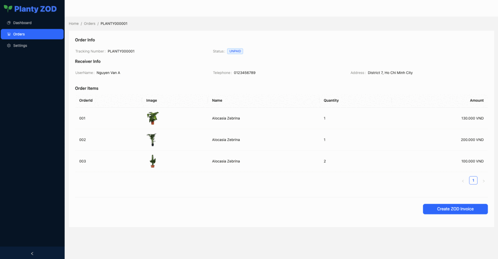

# Quick Start: ZaloPay On Devilivery (ZOD)

## Overview

This repository includes examples of integrations for [ZaloPay On Delivery](https://docs.zalopay.vn/downloads/api/ZaloPay-APIs-AgreementPay-Integration-Document.pdf) (ZOD).
Within this demo app, you'll find a simplified version of an e-commerce website, complete with commented code to
highlight key features and concepts of ZaloPay's API.

ZOD is a payment solution which gives your customers the comfort of digital payment at the time of delivery while reducing the risks and costs of traditional Cash On Delivery (COD) payment.



## Requirements

- Node.js 16+
- [ZaloPay Test Wallets](https://beta-docs.zalopay.vn/docs/developer-tools/testing#test-wallets)

## Installation

1. Clone this repo:

```
git clone 
```

2. Navigate to the root directory and install dependencies:

```
npm install
```

## Usage

1. Update `next.config.js` file with your [Merchant information](https://docs.zalopay.vn/v2/start/):

```sh
ZLP_MERCHANT_APP_ID="your_app_id_here"
ZLP_MERCHANT_KEY1="your_key1_here"
ZLP_MERCHANT_KEY2="your_key2_here"
ZLP_MERCHANT_ENDPOINT="zalopay_merchant_endpoint_here"
```

Or you can use this testing merchant account.

```text
ZLP_MERCHANT_APP_ID: '553',
ZLP_MERCHANT_KEY1: '9phuAOYhan4urywHTh0ndEXiV3pKHr5Q',
ZLP_MERCHANT_KEY2: 'A53q3asfJ9qQMEVDUuruW86nIloLoAUq',
```

2. Build & Start the server:

```sh
npm run dev
```

3. Visit [http://localhost:3000](http://localhost:3000).

To try out payment you need install and register ZaloPay Sanbox ,
see [Trải nghiệm với ZaloPay](https://docs.zalopay.vn/v2/start/#A).

**Note**

This example doesn't include the callback when run at localhost, see how to integration callback in next section

## Troubleshooting

### Callback testing

Callback (a.k.a Webhook) is a mechanism to deliver Instant Payment Notification asynchronously for Merchant Server
receives payment's results from ZaloPay Server, only when ZaloPay has received money from user successfully, and it is
important to test them during the setup of your integration.
You can find more information about callbacks in [here](https://docs.zalopay.vn/en/v2/general/overview.html#callback).

This sample application provides 2 simple callbacks integration exposed at `pages/api/callback`. For it to work, you
need to:

1. Provide a way for the ZaloPay Server to reach your running application
2. Add a callback url to ZaloPay Server notify to your application.

### Making your server reachable

Your endpoint that will consume the incoming callback must be publicly accessible.

There are typically many options, in this example we can expose your localhost with tunneling software (i.e. ngrok)

If you use a tunneling service like [ngrok](ngrok) the webhook URL will be the generated URL (
ie `https://c991-80-113-16-28.ngrok.io`)

```bash
  $ ngrok http 3000
  
  Session Status                online                                                                                           
  Account                       ############                                                                      
  Version                       #########                                                                                          
  Region                        United States (us)                                                                                 
  Forwarding                    https://c991-80-113-16-28.ngrok.io -> http://localhost:3000           
```

**Note:** when restarting ngrok a new URL is generated, make sure to **update the Webhook URL** in the Merchant Portal

### Callback setup

Set up a callback URL:
- Set up in [Sanbox Merchant Portal](https://sbmc.zalopay.vn/home).

If the callback setup is worked, the following message is shown:

```text
💰  Payment callback received!
✅  Update order's status = success where mcRefId = 230519_645224
```

## Author(s)

- [Phuc Vo](https://github.com/NoRaDoMi)